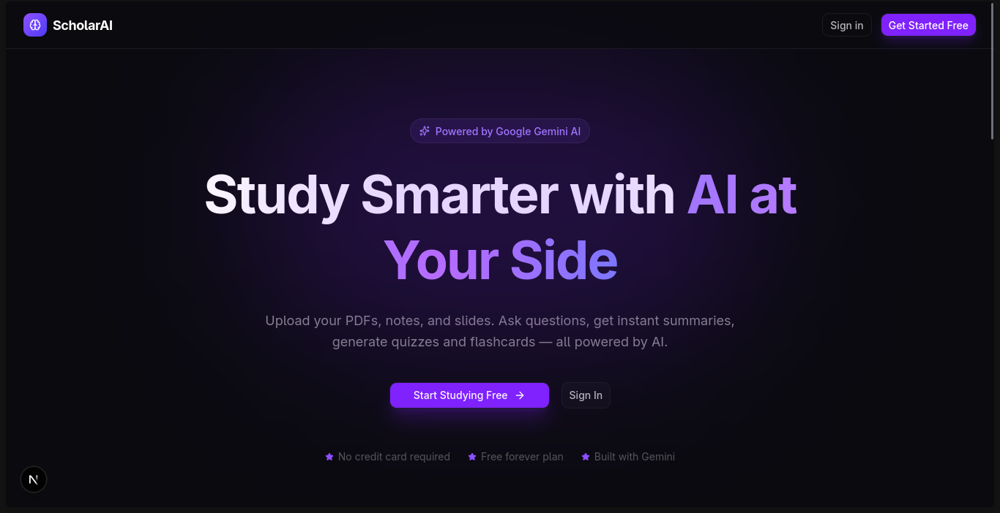
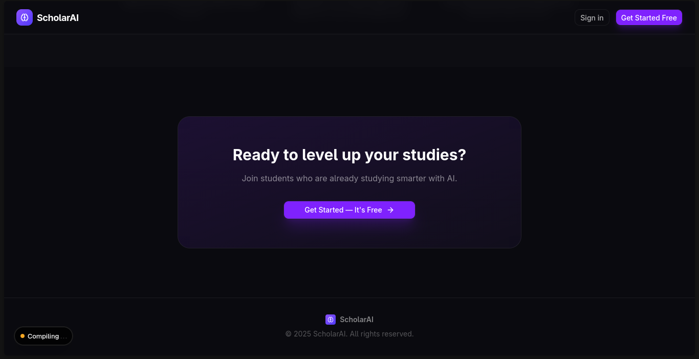
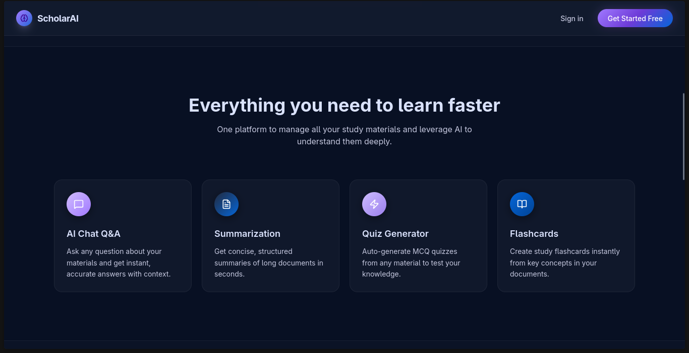
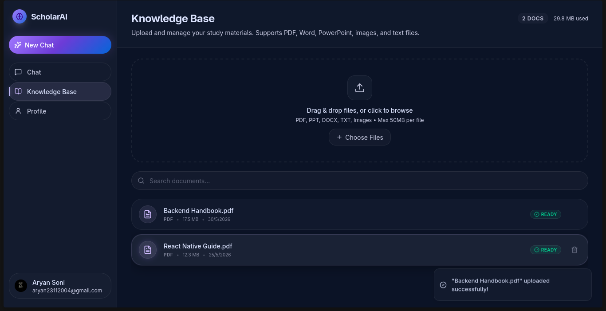
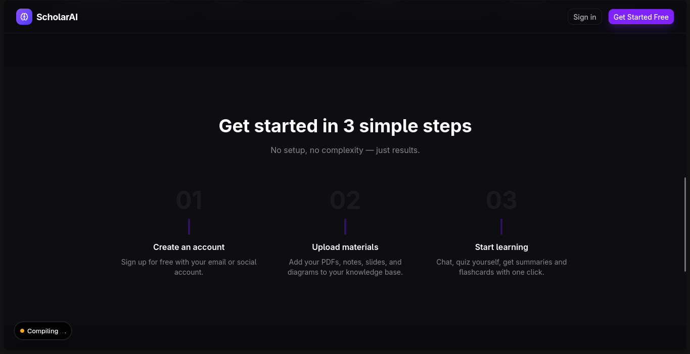
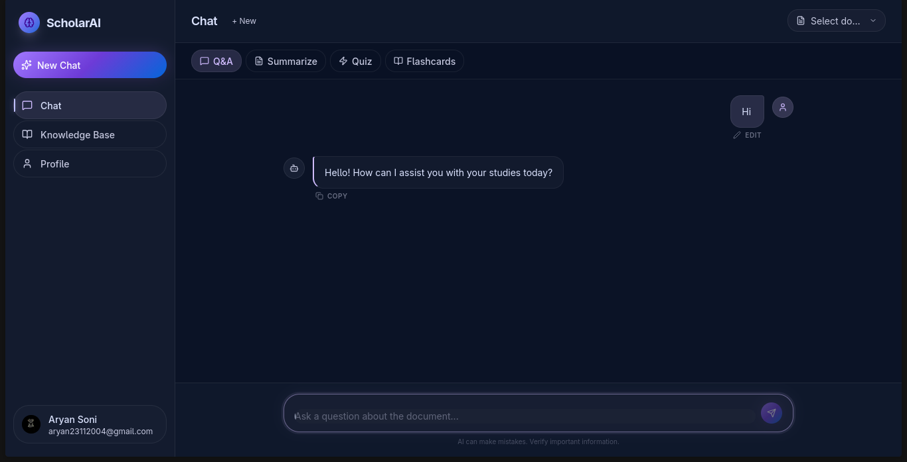
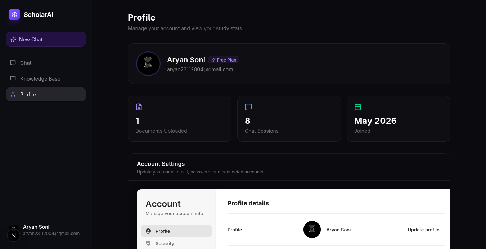

<div align="center">
  <h1>🎓 ScholarAI</h1>
  <p><strong>Your Ultimate AI-Powered Study Assistant</strong></p>
</div>



## 📌 Overview

**ScholarAI** is a comprehensive, web-based platform designed to transform how students interact with their study materials. Rather than using disconnected PDF readers and generic AI chatbots, ScholarAI provides a unified experience. You can upload digital study resources (PDFs, PPTs, etc.), extract their text automatically, and study them using context-aware AI.

Whether you need quick summarization, automated quiz generation, Q&A on specific documents, or flashcard creation, ScholarAI grounds every interaction in *your* uploaded knowledge base.

## 🚀 Features

- **📚 Personal Knowledge Base:** Upload study documents (PDF, Presentation, Text). Automatic text extraction securely stores the content.
- **🤖 Context-Aware AI Chat:** Ask questions and get answers *based entirely* on your provided documents, avoiding generic, unreliable AI responses.
- **🔄 Multiple Study Modes:**
  - **Q&A Mode:** Clear your doubts from the text.
  - **Summarization Mode:** Condense long chapters into bite-sized summaries.
  - **Quiz Generation:** Challenge yourself with AI-generated questions to test your knowledge.
  - **Flashcards:** Auto-create interactive flashcards to drill core concepts.
- **🔐 Secure Authentication:** Seamless user onboarding via Clerk.
- **⚡ Real-Time Sync:** Instant UI updates and real-time backend powered by Convex.

## 📸 Screenshots

| Feature | Screenshot |
|---------|-----------|
| **Dashboard / CTA** |  |
| **Project Features** |  |
| **Knowledge Base** |  |
| **Study Workflow** |  |
| **AI Chat & Study** |  |
| **User Profile** |  |

## 🛠️ Tech Stack

ScholarAI is built using a modern full-stack web ecosystem:

- **Frontend:** [Next.js 16](https://nextjs.org/) (App Router), React 19, Tailwind CSS, Shadcn UI / Radix UI
- **Backend & Database:** [Convex](https://convex.dev/) (Serverless Database & Functions)
- **Authentication:** [Clerk](https://clerk.com/)
- **AI & Processing:** AI SDK, OpenRouter (GPT-4o-mini), `pdf-parse` for text extraction
- **Language:** TypeScript

## 🏎️ Getting Started

Follow these steps to run ScholarAI locally:

### 1. Clone the repository
```bash
git clone https://github.com/yourusername/scholarai.git
cd scholarai
```

### 2. Install Dependencies
```bash
npm install
```

### 3. Set up Environment Variables
Rename `.env.example` to `.env.local` (or create it) and add your keys:
```env
NEXT_PUBLIC_CLERK_PUBLISHABLE_KEY=your_clerk_publishable_key
CLERK_SECRET_KEY=your_clerk_secret_key
NEXT_PUBLIC_CONVEX_URL=your_convex_url
OPENROUTER_API_KEY=your_openrouter_api_key
```

### 4. Start the Convex Backend
```bash
npx convex dev
```

### 5. Start the Next.js Development Server
In a separate terminal tab:
```bash
npm run dev
```
Your app will be available on [http://localhost:3000](http://localhost:3000).

## 📄 Architecture

The core philosophy of ScholarAI leverages **RAG (Retrieval-Augmented Generation)** techniques. By extracting and indexing document context into a Convex real-time database, prompts sent to the LLM are enriched with specific file context, ensuring the study assistant remains completely grounded in the user's specific learning materials.

## 🤝 Contributing

Contributions, issues, and feature requests are welcome! Feel free to check out the issues page if you want to contribute.

---
> Developed as an innovative educational tool combining document management and intelligent tutoring natively.
