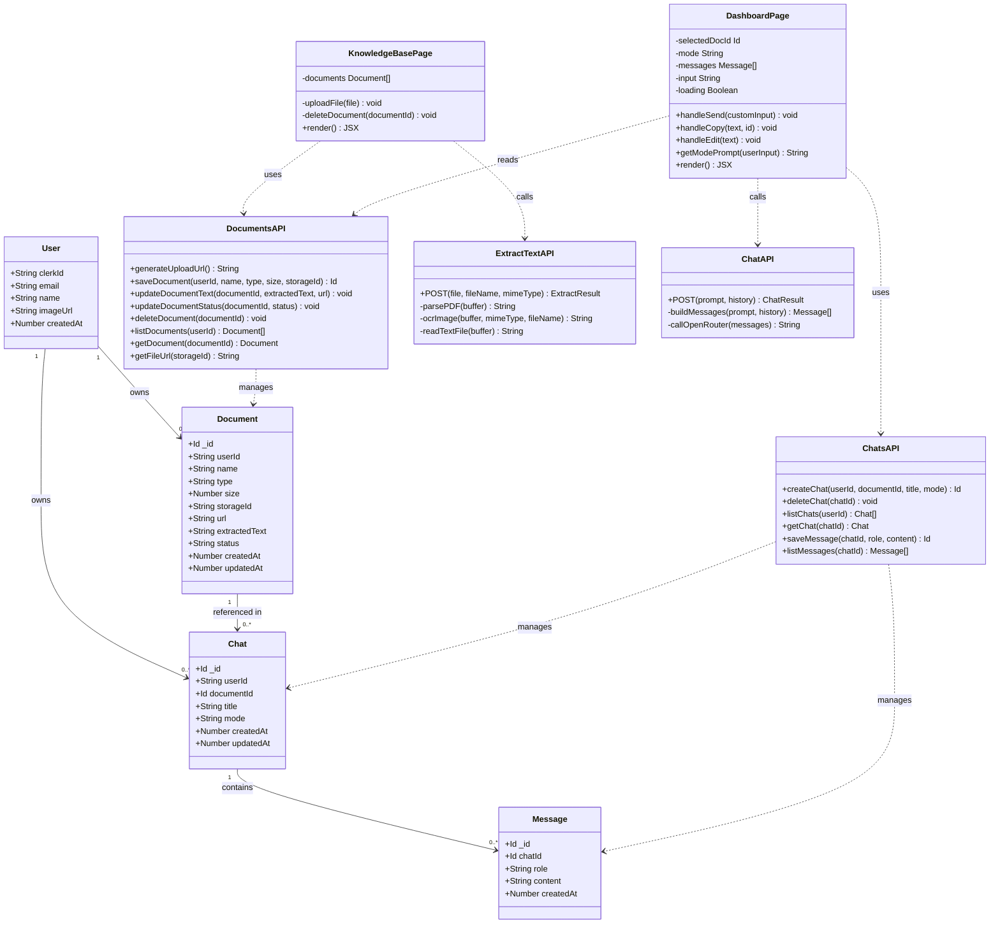

# Class Diagram — ScholarAI

```mermaid
classDiagram
    class User {
        +String clerkId
        +String email
        +String name
        +String imageUrl
        +Number createdAt
    }

    class Document {
        +Id _id
        +String userId
        +String name
        +String type
        +Number size
        +String storageId
        +String url
        +String extractedText
        +String status
        +Number createdAt
        +Number updatedAt
    }

    class Chat {
        +Id _id
        +String userId
        +Id documentId
        +String title
        +String mode
        +Number createdAt
        +Number updatedAt
    }

    class Message {
        +Id _id
        +Id chatId
        +String role
        +String content
        +Number createdAt
    }

    class DocumentsAPI {
        +generateUploadUrl() String
        +saveDocument(userId, name, type, size, storageId) Id
        +updateDocumentText(documentId, extractedText, url) void
        +updateDocumentStatus(documentId, status) void
        +deleteDocument(documentId) void
        +listDocuments(userId) Document[]
        +getDocument(documentId) Document
        +getFileUrl(storageId) String
    }

    class ChatsAPI {
        +createChat(userId, documentId, title, mode) Id
        +deleteChat(chatId) void
        +listChats(userId) Chat[]
        +getChat(chatId) Chat
        +saveMessage(chatId, role, content) Id
        +listMessages(chatId) Message[]
    }

    class ExtractTextAPI {
        +POST(file, fileName, mimeType) ExtractResult
        -parsePDF(buffer) String
        -ocrImage(buffer, mimeType, fileName) String
        -readTextFile(buffer) String
    }

    class ChatAPI {
        +POST(prompt, history) ChatResult
        -buildMessages(prompt, history) Message[]
        -callOpenRouter(messages) String
    }

    class KnowledgeBasePage {
        -documents Document[]
        -uploadFile(file) void
        -deleteDocument(documentId) void
        +render() JSX
    }

    class DashboardPage {
        -selectedDocId Id
        -mode String
        -messages Message[]
        -input String
        -loading Boolean
        +handleSend(customInput) void
        +handleCopy(text, id) void
        +handleEdit(text) void
        +getModePrompt(userInput) String
        +render() JSX
    }

    User "1" --> "0..*" Document : owns
    User "1" --> "0..*" Chat : owns
    Document "1" --> "0..*" Chat : referenced in
    Chat "1" --> "0..*" Message : contains
    DocumentsAPI ..> Document : manages
    ChatsAPI ..> Chat : manages
    ChatsAPI ..> Message : manages
    KnowledgeBasePage ..> DocumentsAPI : uses
    KnowledgeBasePage ..> ExtractTextAPI : calls
    DashboardPage ..> ChatsAPI : uses
    DashboardPage ..> ChatAPI : calls
    DashboardPage ..> DocumentsAPI : reads
```
