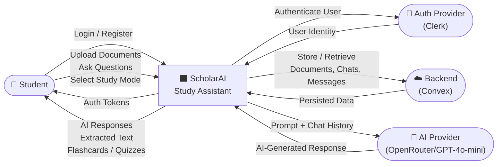

# DFD Level 0 — Context Diagram

```mermaid
flowchart LR
    Student(["👤 Student"])
    AI(["🤖 AI Provider\n(OpenRouter/GPT-4o-mini)"])
    Clerk(["🔐 Auth Provider\n(Clerk)"])
    Convex(["☁️ Backend\n(Convex)"])

    ScholarAI["⬛ ScholarAI\nStudy Assistant"]

    Student -- "Login / Register" --> ScholarAI
    ScholarAI -- "Auth Tokens" --> Student

    ScholarAI -- "Authenticate User" --> Clerk
    Clerk -- "User Identity" --> ScholarAI

    Student -- "Upload Documents\nAsk Questions\nSelect Study Mode" --> ScholarAI
    ScholarAI -- "AI Responses\nExtracted Text\nFlashcards / Quizzes" --> Student

    ScholarAI -- "Store / Retrieve\nDocuments, Chats, Messages" --> Convex
    Convex -- "Persisted Data" --> ScholarAI

    ScholarAI -- "Prompt + Chat History" --> AI
    AI -- "AI-Generated Response" --> ScholarAI
```
