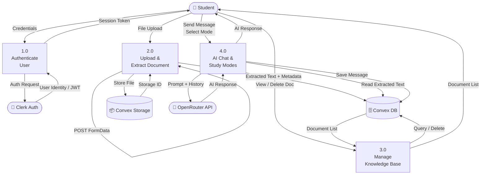

# DFD Level 1 — System Processes

```mermaid
flowchart TD
    Student(["👤 Student"])
    Clerk(["🔐 Clerk Auth"])
    ConvexDB[("🗄️ Convex DB")]
    ConvexStorage[("📦 Convex Storage")]
    OpenRouter(["🤖 OpenRouter API"])

    P1["1.0\nAuthenticate\nUser"]
    P2["2.0\nUpload &\nExtract Document"]
    P3["3.0\nManage\nKnowledge Base"]
    P4["4.0\nAI Chat &\nStudy Modes"]

    Student -- "Credentials" --> P1
    P1 -- "Auth Request" --> Clerk
    Clerk -- "User Identity / JWT" --> P1
    P1 -- "Session Token" --> Student

    Student -- "File Upload" --> P2
    P2 -- "Store File" --> ConvexStorage
    ConvexStorage -- "Storage ID" --> P2
    P2 -- "POST FormData" --> P2
    P2 -- "Extracted Text + Metadata" --> ConvexDB

    Student -- "View / Delete Doc" --> P3
    P3 -- "Query / Delete" --> ConvexDB
    ConvexDB -- "Document List" --> P3
    P3 -- "Document List" --> Student

    Student -- "Send Message\nSelect Mode" --> P4
    P4 -- "Read Extracted Text" --> ConvexDB
    P4 -- "Prompt + History" --> OpenRouter
    OpenRouter -- "AI Response" --> P4
    P4 -- "Save Message" --> ConvexDB
    P4 -- "AI Response" --> Student
```
