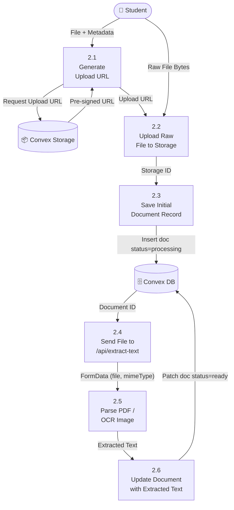
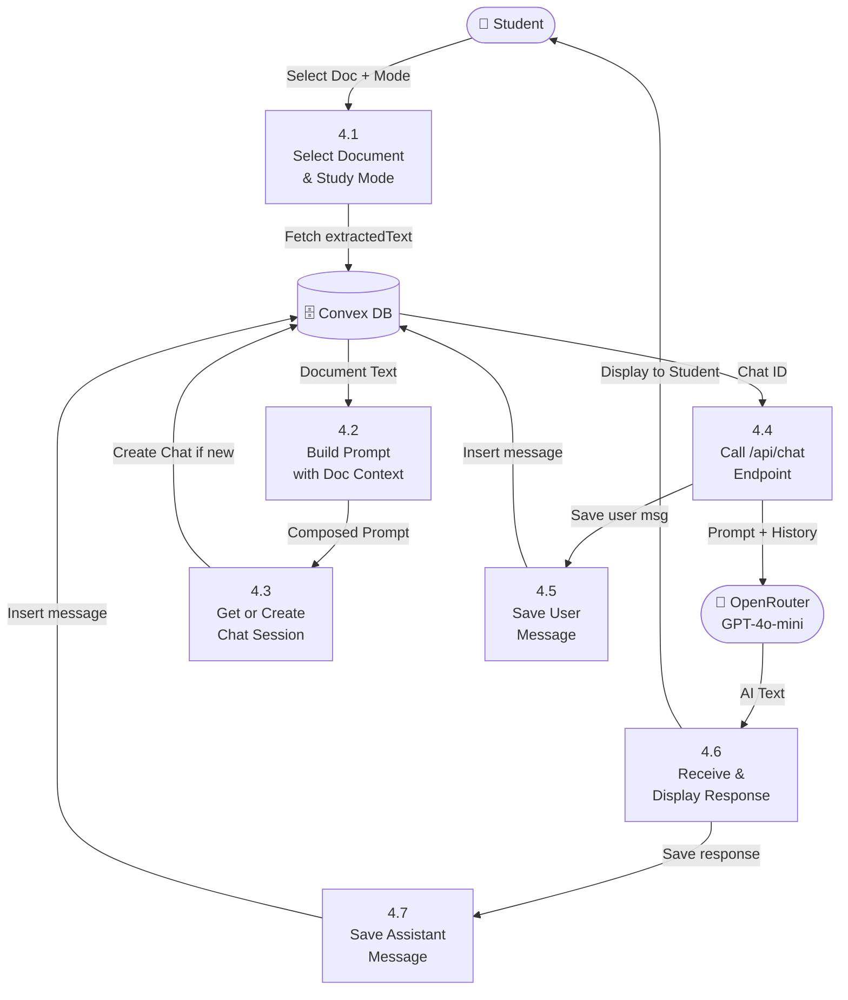

# DFD Level 2 — Decomposed Sub-Processes

## 2.1 — Upload & Extract Document (Process 2.0 Expanded)

```mermaid
flowchart TD
    Student(["👤 Student"])
    ConvexDB[("🗄️ Convex DB")]
    ConvexStorage[("📦 Convex Storage")]

    P2_1["2.1\nGenerate\nUpload URL"]
    P2_2["2.2\nUpload Raw\nFile to Storage"]
    P2_3["2.3\nSave Initial\nDocument Record"]
    P2_4["2.4\nSend File to\n/api/extract-text"]
    P2_5["2.5\nParse PDF /\nOCR Image"]
    P2_6["2.6\nUpdate Document\nwith Extracted Text"]

    Student -- "File + Metadata" --> P2_1
    P2_1 -- "Request Upload URL" --> ConvexStorage
    ConvexStorage -- "Pre-signed URL" --> P2_1
    P2_1 -- "Upload URL" --> P2_2
    Student -- "Raw File Bytes" --> P2_2
    P2_2 -- "Storage ID" --> P2_3
    P2_3 -- "Insert doc status=processing" --> ConvexDB
    ConvexDB -- "Document ID" --> P2_4
    P2_4 -- "FormData (file, mimeType)" --> P2_5
    P2_5 -- "Extracted Text" --> P2_6
    P2_6 -- "Patch doc status=ready" --> ConvexDB
```

## 2.2 — AI Chat & Study Modes (Process 4.0 Expanded)

```mermaid
flowchart TD
    Student(["👤 Student"])
    ConvexDB[("🗄️ Convex DB")]
    OpenRouter(["🤖 OpenRouter\nGPT-4o-mini"])

    P4_1["4.1\nSelect Document\n& Study Mode"]
    P4_2["4.2\nBuild Prompt\nwith Doc Context"]
    P4_3["4.3\nGet or Create\nChat Session"]
    P4_4["4.4\nCall /api/chat\nEndpoint"]
    P4_5["4.5\nSave User\nMessage"]
    P4_6["4.6\nReceive &\nDisplay Response"]
    P4_7["4.7\nSave Assistant\nMessage"]

    Student -- "Select Doc + Mode" --> P4_1
    P4_1 -- "Fetch extractedText" --> ConvexDB
    ConvexDB -- "Document Text" --> P4_2
    P4_2 -- "Composed Prompt" --> P4_3
    P4_3 -- "Create Chat if new" --> ConvexDB
    ConvexDB -- "Chat ID" --> P4_4
    P4_4 -- "Save user msg" --> P4_5
    P4_5 -- "Insert message" --> ConvexDB
    P4_4 -- "Prompt + History" --> OpenRouter
    OpenRouter -- "AI Text" --> P4_6
    P4_6 -- "Display to Student" --> Student
    P4_6 -- "Save response" --> P4_7
    P4_7 -- "Insert message" --> ConvexDB
```
