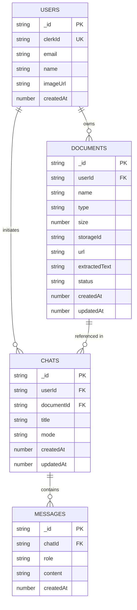

# Entity Relationship Diagram (ERD) — ScholarAI

## Field Notes

| Table | Key Fields | Index |
|---|---|---|
| `users` | `clerkId` (unique) | `by_clerk_id` |
| `documents` | `userId`, `status` | `by_user`, `by_user_and_status` |
| `chats` | `userId`, `documentId` | `by_user`, `by_user_and_document` |
| `messages` | `chatId` | `by_chat` |

**Status values for `documents`:** `"uploading"` → `"processing"` → `"ready"` | `"error"`

**Mode values for `chats`:** `"qa"` | `"summarize"` | `"quiz"` | `"flashcards"`

**Role values for `messages`:** `"user"` | `"assistant"`
