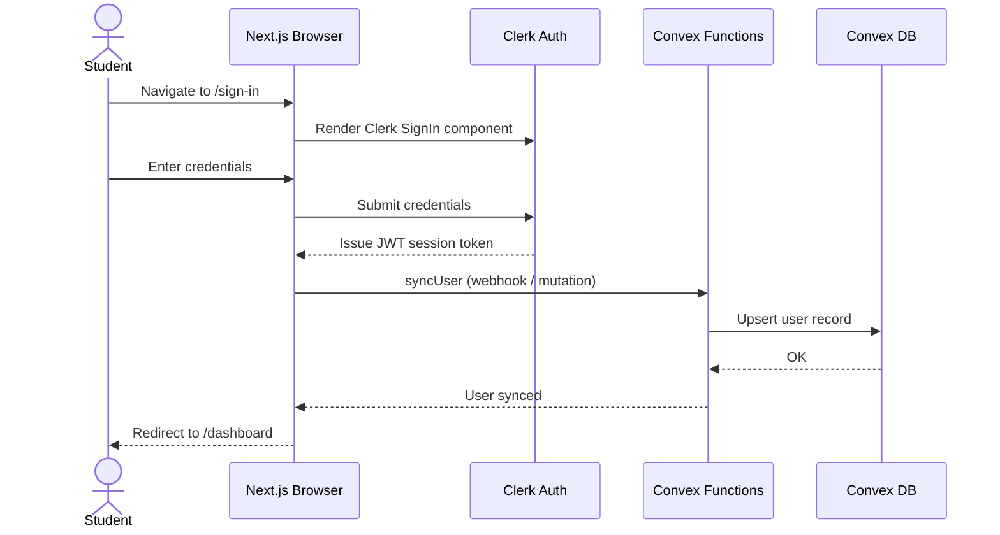
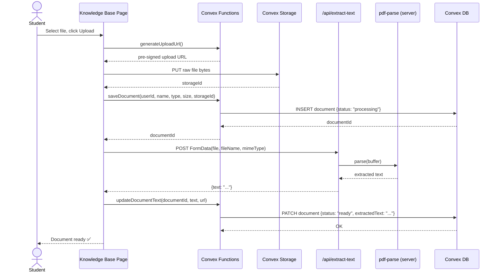
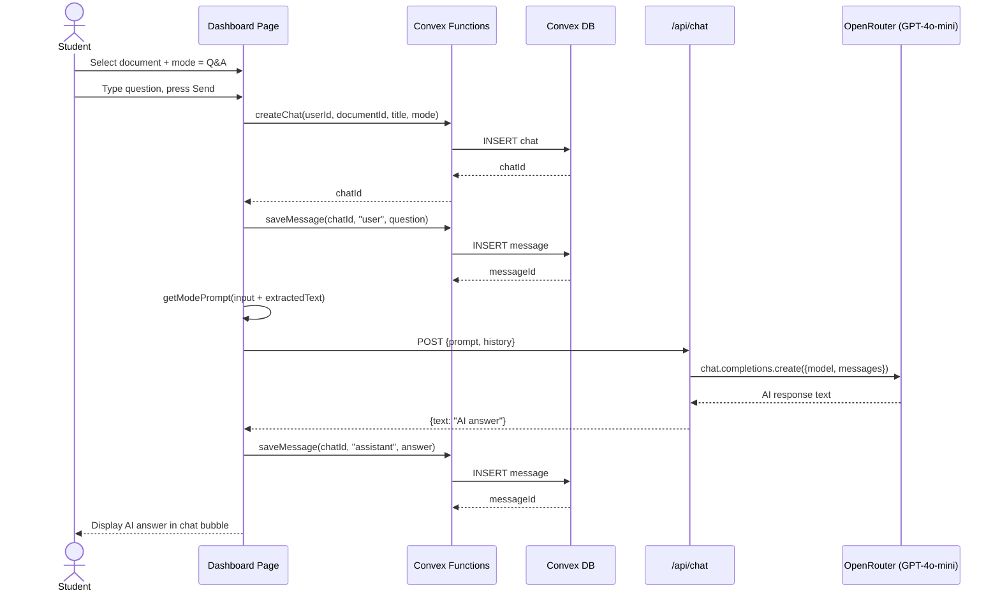

# Sequence Diagram — ScholarAI

## SD1: User Authentication (Sign In)

```mermaid
sequenceDiagram
    actor Student
    participant Browser as Next.js Browser
    participant Clerk as Clerk Auth
    participant ConvexFn as Convex Functions
    participant DB as Convex DB

    Student->>Browser: Navigate to /sign-in
    Browser->>Clerk: Render Clerk SignIn component
    Student->>Browser: Enter credentials
    Browser->>Clerk: Submit credentials
    Clerk-->>Browser: Issue JWT session token
    Browser->>ConvexFn: syncUser (webhook / mutation)
    ConvexFn->>DB: Upsert user record
    DB-->>ConvexFn: OK
    ConvexFn-->>Browser: User synced
    Browser-->>Student: Redirect to /dashboard
```

---

## SD2: Upload & Extract Document

```mermaid
sequenceDiagram
    actor Student
    participant KBPage as Knowledge Base Page
    participant ConvexFn as Convex Functions
    participant Storage as Convex Storage
    participant ExtractAPI as /api/extract-text
    participant pdfparse as pdf-parse (server)
    participant DB as Convex DB

    Student->>KBPage: Select file, click Upload
    KBPage->>ConvexFn: generateUploadUrl()
    ConvexFn-->>KBPage: pre-signed upload URL

    KBPage->>Storage: PUT raw file bytes
    Storage-->>KBPage: storageId

    KBPage->>ConvexFn: saveDocument(userId, name, type, size, storageId)
    ConvexFn->>DB: INSERT document {status: "processing"}
    DB-->>ConvexFn: documentId
    ConvexFn-->>KBPage: documentId

    KBPage->>ExtractAPI: POST FormData(file, fileName, mimeType)
    ExtractAPI->>pdfparse: parse(buffer)
    pdfparse-->>ExtractAPI: extracted text

    ExtractAPI-->>KBPage: {text: "..."}
    KBPage->>ConvexFn: updateDocumentText(documentId, text, url)
    ConvexFn->>DB: PATCH document {status: "ready", extractedText: "..."}
    DB-->>ConvexFn: OK
    KBPage-->>Student: Document ready ✅
```

---

## SD3: AI Chat Q&A Interaction

```mermaid
sequenceDiagram
    actor Student
    participant Dashboard as Dashboard Page
    participant ConvexFn as Convex Functions
    participant DB as Convex DB
    participant ChatAPI as /api/chat
    participant OpenRouter as OpenRouter (GPT-4o-mini)

    Student->>Dashboard: Select document + mode = Q&A
    Student->>Dashboard: Type question, press Send

    Dashboard->>ConvexFn: createChat(userId, documentId, title, mode)
    ConvexFn->>DB: INSERT chat
    DB-->>ConvexFn: chatId
    ConvexFn-->>Dashboard: chatId

    Dashboard->>ConvexFn: saveMessage(chatId, "user", question)
    ConvexFn->>DB: INSERT message
    DB-->>ConvexFn: messageId

    Dashboard->>Dashboard: getModePrompt(input + extractedText)
    Dashboard->>ChatAPI: POST {prompt, history}

    ChatAPI->>OpenRouter: chat.completions.create({model, messages})
    OpenRouter-->>ChatAPI: AI response text

    ChatAPI-->>Dashboard: {text: "AI answer"}

    Dashboard->>ConvexFn: saveMessage(chatId, "assistant", answer)
    ConvexFn->>DB: INSERT message
    DB-->>ConvexFn: messageId

    Dashboard-->>Student: Display AI answer in chat bubble
```
