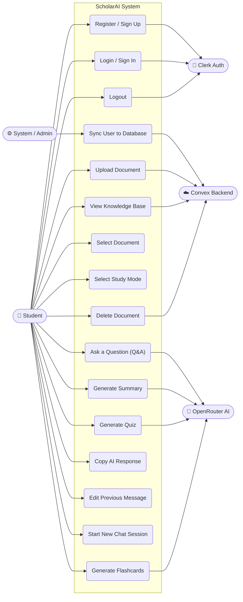

# Use Case Diagram — ScholarAI

```mermaid
flowchart LR
    Student(["👤 Student"])
    Admin(["⚙️ System / Admin"])
    Clerk(["🔐 Clerk Auth"])
    OpenRouter(["🤖 OpenRouter AI"])
    ConvexDB(["☁️ Convex Backend"])

    subgraph ScholarAI System
        UC1("Register / Sign Up")
        UC2("Login / Sign In")
        UC3("Logout")

        UC4("Upload Document")
        UC5("View Knowledge Base")
        UC6("Delete Document")

        UC7("Select Document")
        UC8("Select Study Mode")
        UC9("Ask a Question (Q&A)")
        UC10("Generate Summary")
        UC11("Generate Quiz")
        UC12("Generate Flashcards")

        UC13("Copy AI Response")
        UC14("Edit Previous Message")
        UC15("Start New Chat Session")

        UC16("Sync User to Database")
    end

    Student --> UC1
    Student --> UC2
    Student --> UC3
    Student --> UC4
    Student --> UC5
    Student --> UC6
    Student --> UC7
    Student --> UC8
    Student --> UC9
    Student --> UC10
    Student --> UC11
    Student --> UC12
    Student --> UC13
    Student --> UC14
    Student --> UC15

    UC1 --> Clerk
    UC2 --> Clerk
    UC3 --> Clerk
    UC16 --> ConvexDB

    UC4 --> ConvexDB
    UC5 --> ConvexDB
    UC6 --> ConvexDB

    UC9 --> OpenRouter
    UC10 --> OpenRouter
    UC11 --> OpenRouter
    UC12 --> OpenRouter

    Admin --> UC16
```
